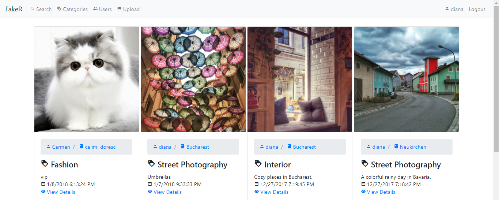
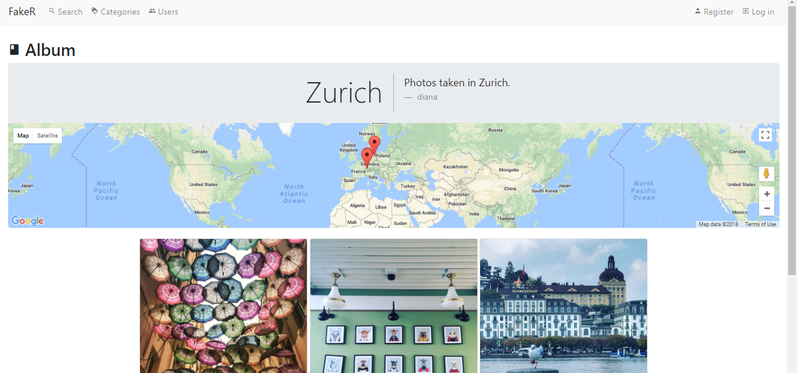
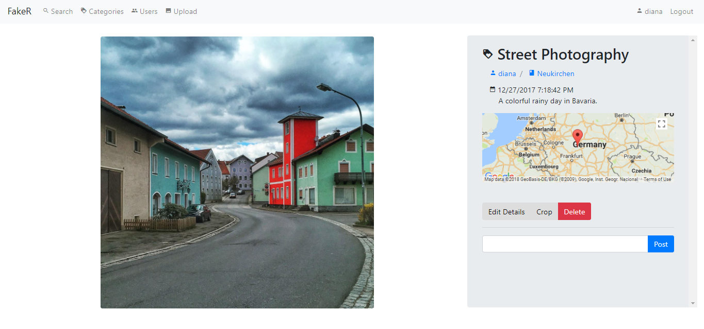

# fake-r
Not nicely written project for the Web Applications Development lab, meant to be an application for photo sharing ([6th option](http://daw-aspnet.herokuapp.com/ProiecteDAW)).

The project satisfies the following requirements:
- There are three types of users (unregistered, registered and admin)
- Any user can see the photos uploaded on the website. The home page displays the most recent photos.
- Each photo belongs to a category.
- Each user can create and edit the user profile.
- Each user can add albums.
- The users can add comments to the uploaded photos. The admins and the user that posts the photo can manage these comments.
- The users can search photos by key words or by location (used *Gooogle Maps*).
- The users can crop their uploaded photos (Used [*Jcrop*](http://deepliquid.com/content/Jcrop.html)).
- The administrators can delete photos and comments.

## Homepage

## Album

## Photo

